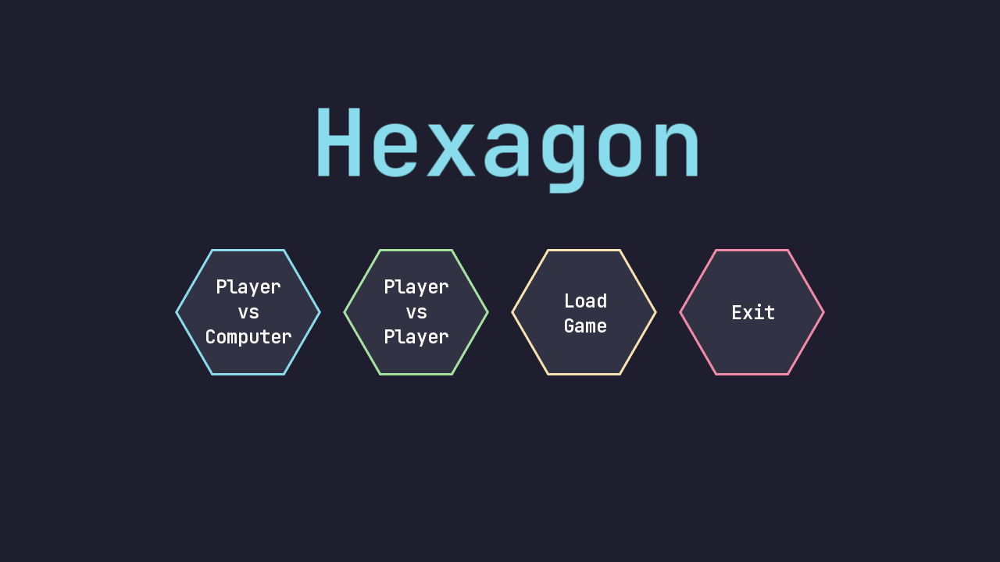
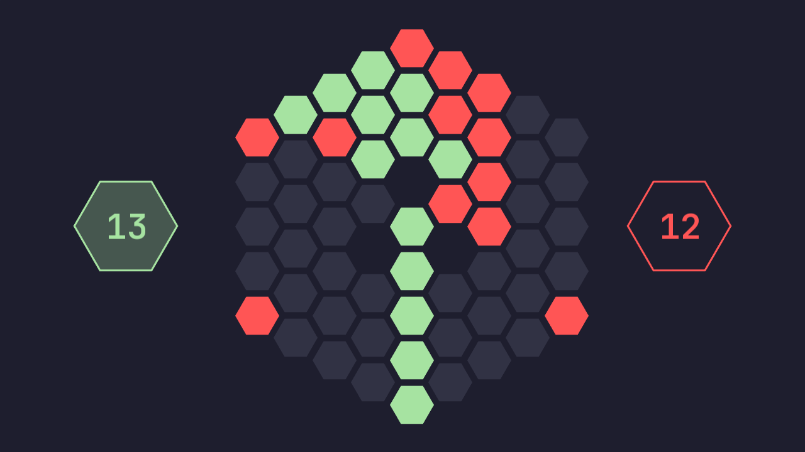

# Hexxagon

Hexxagon is a classic turn-based strategy board game implemented in C++ using the SFML library.

## Description

Hexxagon is a two-player board game where the goal is to capture as many cells as possible. Players ta1ke turns cloning or moving their pieces to capture opponent's cells.
This version supports both local multiplayer and playing against the computer (AI).


## Screenshots
### Menu

### Game



## Features

- Classic Hexxagon mechanics
- Graphical interface with SFML
- Play against another player or the computer (AI)
- Score tracking and winner detection

## Installation and Running

1. Clone the repository:

    ``` bash
    git clone ....
    ```
2. Go to the project directory:

    ``` bash
    cd Hexagon
    ```
3. Build the project (using CMake):
    ``` bash
    mkdir build
    cd build
    cmake ..
    make
    ``` 
4. Run the game:

    ``` bash
    ./Hexagon
    ```


